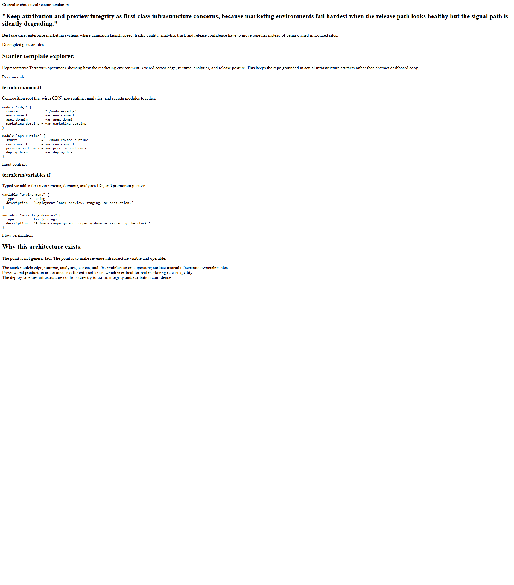
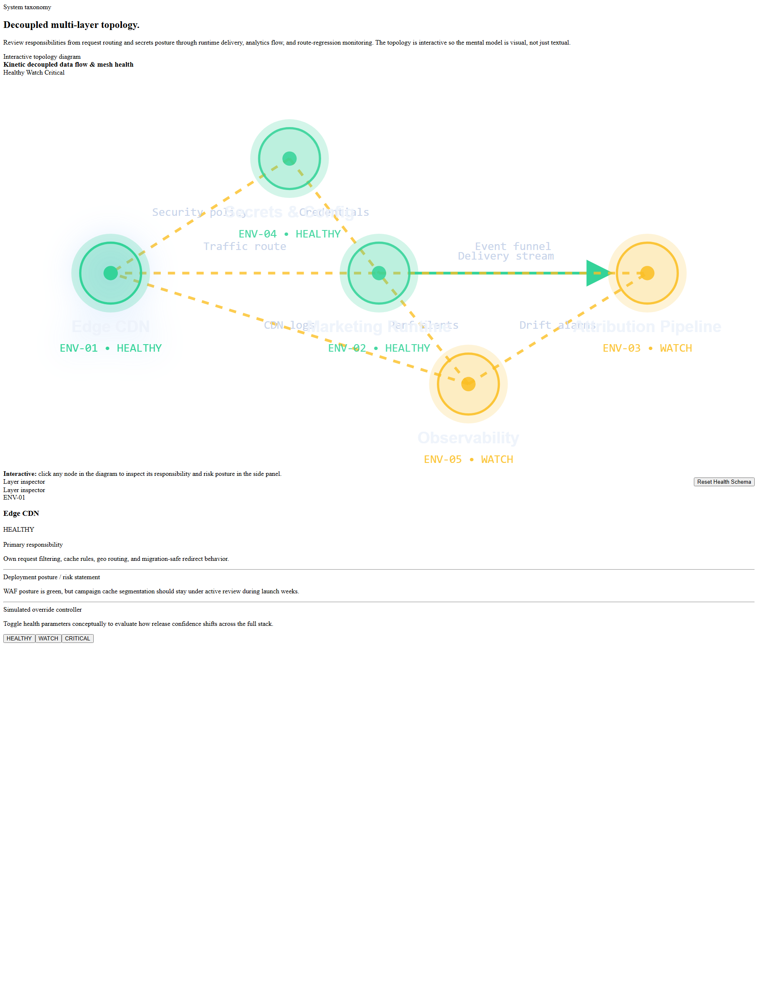
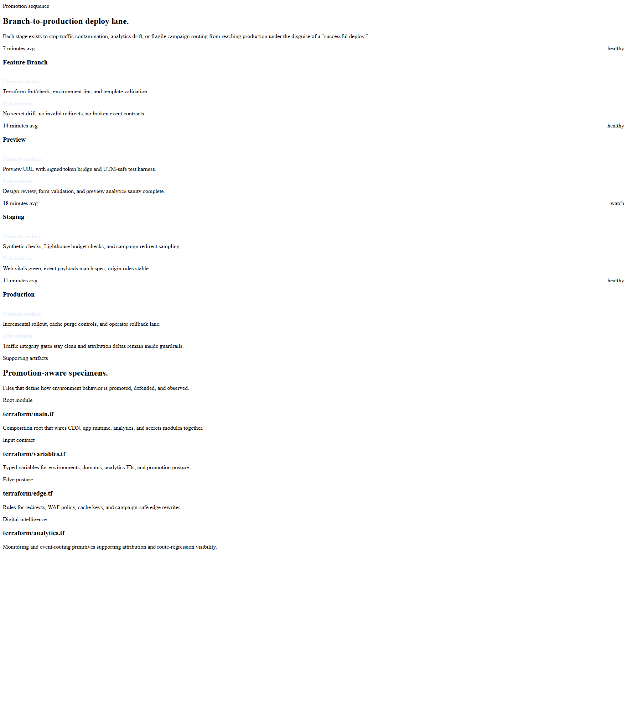
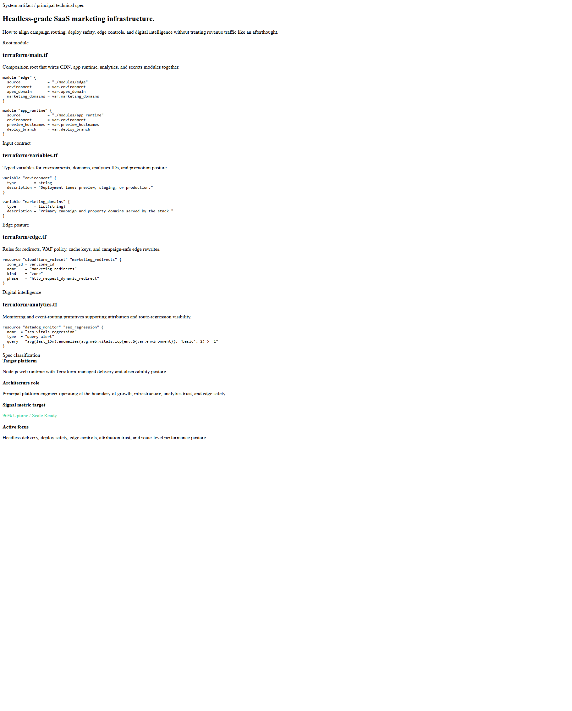
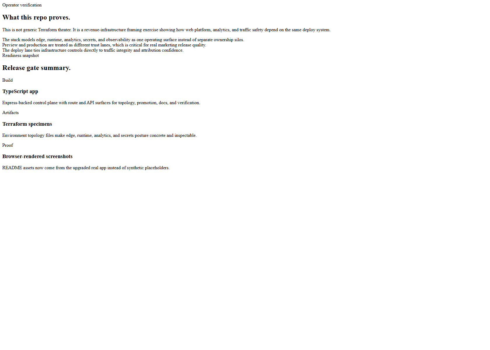

# IAC SaaS Marketing

Board-ready Kinetic Gain surface for scalable SaaS marketing infrastructure, promotion flow, edge posture, and environment readiness.

- Live: [http://iac.kineticgain.com/](http://iac.kineticgain.com/)
- Repo: [https://github.com/mizcausevic-dev/iac-saas-marketing](https://github.com/mizcausevic-dev/iac-saas-marketing)

## What it shows

- environment topology across edge, app, data, and observability layers
- deploy-lane posture for branch-to-production promotion
- modeled Terraform artifacts for CDN, app platform, analytics, and secrets
- operator verification for growth-safe releases

## Screenshots

### Overview



### Environment Topology



### Deploy Lane



### Documentation



### Verification



## Routes

- `/`
- `/environment-topology`
- `/deploy-lane`
- `/verification`
- `/docs`

## API

- `/api/dashboard/summary`
- `/api/environment-topology`
- `/api/deploy-lane`
- `/api/infrastructure-artifacts`
- `/api/verification`
- `/api/sample`

## Local development

```powershell
cd iac-saas-marketing
npm install
npm run dev
```

Then open:

- `http://127.0.0.1:5396/`
- `http://127.0.0.1:5396/environment-topology`
- `http://127.0.0.1:5396/deploy-lane`
- `http://127.0.0.1:5396/verification`
- `http://127.0.0.1:5396/docs`

## Validation

```powershell
npm run verify
npm run prerender
npm run render:assets
```

## Documentation

- [docs/architecture.md](./docs/architecture.md)
- [docs/ORIGIN.md](./docs/ORIGIN.md)
